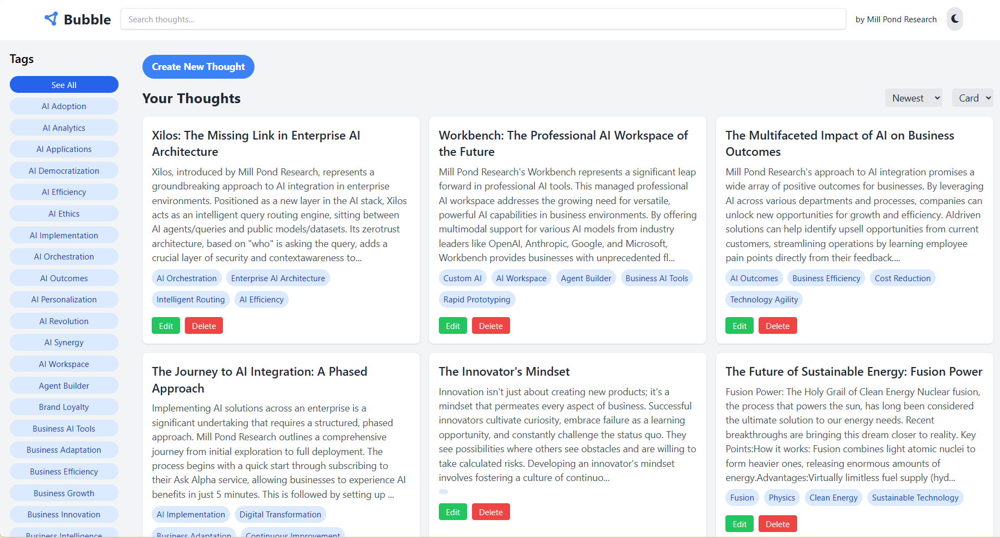

# Bubble by Mill Pond Research

Bubble is a modern, intuitive thought-capturing application designed to help you organize and manage your ideas efficiently.



## Features

- **Create and Edit Thoughts**: Easily add new thoughts or edit existing ones using a rich text editor.
- **Tag System**: Organize your thoughts with tags for easy categorization and retrieval.
- **Search Functionality**: Quickly find specific thoughts using the search feature.
- **Flexible Layouts**: View your thoughts in card, grid, or list layout.
- **Sorting Options**: Sort your thoughts by date (newest/oldest) or title (A-Z/Z-A).
- **Dark Mode**: Toggle between light and dark modes for comfortable viewing.
- **Drag and Drop**: Combine thoughts by dragging and dropping them onto each other.
- **Markdown Support**: Write your thoughts in Markdown and see them rendered beautifully.
- **Local Storage**: All your thoughts are saved locally as Markdown files.

## Getting Started

1. Clone the repository
2. Install dependencies:
   ```
   npm install
   ```
3. Start the development server:
   ```
   npm start
   ```
4. Open [http://localhost:5173](http://localhost:5173) in your browser to view the app.

## Usage

- **Adding a Thought**: Click the "New Thought" button to create a new thought. Enter a title, body, and tags.
- **Editing a Thought**: Click the "Edit" button on any thought card to modify its content.
- **Deleting a Thought**: Click the "Delete" button on a thought card to remove it.
- **Searching**: Use the search bar in the header to find specific thoughts.
- **Filtering by Tag**: Click on a tag in the sidebar to view all thoughts with that tag.
- **Changing Layout**: Use the layout dropdown to switch between card, grid, and list views.
- **Sorting Thoughts**: Use the sort dropdown to change the order of your thoughts.
- **Dark Mode**: Toggle the sun/moon icon in the header to switch between light and dark modes.

## Technologies Used

- React
- Redux Toolkit
- TypeScript
- Tailwind CSS
- React Beautiful DnD
- React Quill

## Contributing

We welcome contributions to Bubble! Please feel free to submit issues, fork the repository and send pull requests!

## License

This project is licensed under the MIT License.

---

Developed with ❤️ by Mill Pond Research 